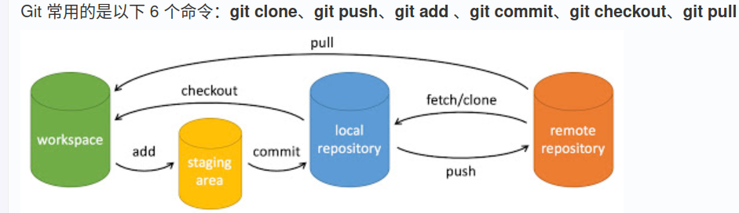

### 提交与修改
git init: 初始化仓库
**git add**: 添加文件到暂存区
git add .  :添加所有更改
git commit: 将暂存区内容添加到仓库
git clone: 拷贝远程仓库
git status: 查看仓库当前状态,显示有变更的文件
git diff: 比较暂存区和工作区的差异
git reset: 回退版本
git rm: 将文件从暂存区和工作区中删除
git mv: 移动或重命名工作区文件
git notes: 添加注释
git checkout: 分支切换
git switch: 更清晰的分支切换
git restore: 恢复或撤销文件更改
git show

### 提交日志
git log: 查看历史提交
git blame  (file) 以列表形式查看指定文件历史修改
git shortlog :生成提交日志摘要
git describe: 生成可读字符串描述当前提交

## 远程
git remote: 远程仓库操作
git fetch: 从远程获取代码库
git pull: 下载远程仓库并合并
git push: 上传远程代码并合并
git submodule 管理包含其他Git仓库的项目
