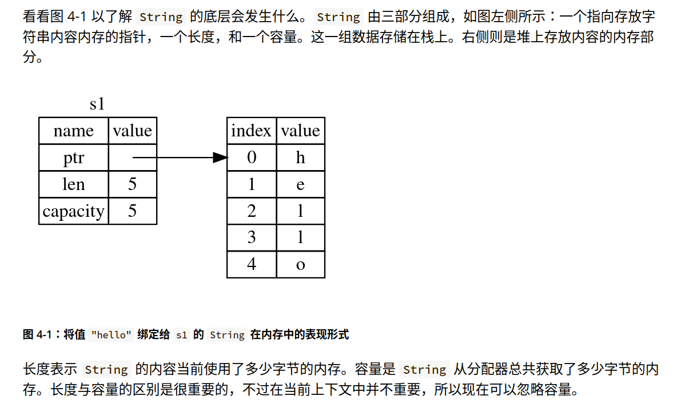
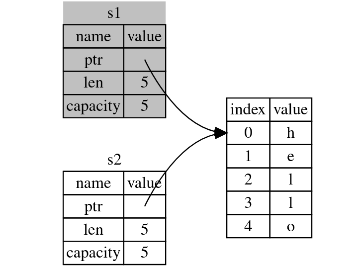

另外的参考书:https://course.rs/about-book.html
1. Start with an example : [Rust_example](#Rust_example)
2. [Variables](#Variables)
3. [Data_Types](#Data_Types)
4. [Function](#Function)
5. [Control_Flow](#Control_Flow)
6. [Ownership](#Ownership)
## Some commands
- Cargo new *** (创建新的项目)
- Cargo run
- Cargo build
- rustup update
## Rust_example

```rust
use std::io;
use rand::Rng;
use std::cmp::Ordi16ering;

fn main() {
    println!("Guess the number!");

    let secret_number = rand::thread_rng().gen_range(1..=100);

    loop {
        println!("Please input your guess.");

        let mut guess = String::new();
        //we use let to create a variable
        //variables are immutable by default
        //to make them mutable, we use mut

        io::stdin()
            .read_line(&mut guess)
            .expect("Failed to read line");
            //read_line is to take whatever the user types into standard input and append that into a string (without overwriting its contents),
            //& indicates reference
            //.read_line will return a Result value(enumeration,enum)
            //The Result(Ok or Err) is aimed to encode error-handling information
            // Ok: successful, inside ok is the successful generated value
            // Err: fail, contain information about how or why the operation failed

        let guess: u32 = match guess.trim().parse() {
            //trim to remove \n or \r\n, parse converts a string to another type
            Ok(num) => num,
            Err(_) => continue,
        };

        println!("You guessed: {}",guess);

        match guess.cmp(&secret_number) {
            Ordering::Less => println!("Too small!"),
            Ordering::Greater => println!("Too big"),
            Ordering::Equal => {
                println!("You win");
                break;
            }
        }
    }
}
```

## Variables

```rust
fn main() {
    let x = 5;
    println!("The value of x is: {x}");
    x = 6;
    println!("The value of x is: {x}");
}
```
This code won't ***compile***, because variable is immutable
But we can use ***mut*** to let it mutable.
变量默认不可改变,必须加上mut才能使其可变
```rust
fn main() {
    let mut x = 5;
    println!("The value of x is: {x}");
    x = 6;
    println!("The value of x is: {x}");
}
```
### Constans
you cannot use mut with constants
常量使用const声明而非let,且始终不可变
```rust
const THREE_HOURS_IN_SECONDS: u32 = 60 * 60 * 3;
```

### Shadowing(隐藏)
重复使用多个let去隐藏同名的前一个变量,直到自己被隐藏或者其他作用域结束
```rust
fn main() {
    let x = 5;

    let x = x + 1;

    {
        let x = x * 2;
        println!("The value of x in the inner scope is: {x}");
		//print: 12
    }
	

    println!("The value of x is: {x}");
	//6
}
```

#### Difference between mut and shadowing:
let can change the type of the value
```rust
    let spaces = "   ";
    let spaces = spaces.len();

```

## Data_Types
two data type: scalar(标量) and compound(复合)
[[#Scalar Types]]
[[#Compound Types]]
Rust is a statically typed language:
编译时必须直到所有变量的类型
```rust
let guess: u32 = "42".parse().expect("Not a number!");
```
***: u32*** type annotation shown is necessary 

### Scalar Types
: represents a single value
- [[#Integer Types]]
- [[#Floating-point Types]]
- [[#The Boolean Type]]
- [[#The Character Type]]
#### Integer Types: 


| Length                    | Signed           | Unsigned         |
| :------------------------ | :--------------- | :--------------- |
| 8-bit<br>16-bit<br>32-bit | i8<br>i16<br>i32 | u8<br>u16<br>u32 |
| 64-bit                    | i64              | u64              |
| 128-bit                   | i128             | u128             |
| arch                      | isize            | usize            |
isize and usize 依赖运行程序的计算机架构,64位架构为64,32为32
允许使用 _ 作为视觉分离器,使得数字易于阅读
*整数类型默认为i32
Decimal(十进制): 98_222(equal to 98222)
Hex(十六进制): 0xff
Octal(八进制): 0o77
Binary: 0b1111_0000
Byte(单字节字符,仅限于u8): b'A'

#### Floating-Point Types
f32 and f64
default: f64
```rust
fn main() {
    let x = 2.0; //f64
    let y: f32 = 3.0; //f32
    
}
```

#### The Boolean Type
```rust
fn main() {
    let t = true;

    let f: bool = false; // with explicit type annotation
}
```

#### The Character Type
```rust
fn main() {
    let c = 'z';
    let z: char = 'ℤ'; // with explicit type annotation
    let heart_eyed_cat = '😻';
}
```

***We use ' to specify char and " to specify string***

### Compound Types
- [[#tuple(元组)]]
- [[#array(数组)]]
#### tuple(元组)
将多个其他类型的值组合进一个复合类型的主要方式,长度固定
```rust
fn main() {
    let tup: (i32, f64, u8) = (500, 6.4, 1);
	let (x, y, z) = tup;
	println!("the value of y is {y}");
}
```
程序首先创建了一个元组绑定到tup
接着使用let解构tup成三个不同的变量(x, y, z)
也可以使用 ***.*** 来索引
```rust
fn main(){
	let x: (i32, f64, u8) = (500, 6.4, 1);
	let five_hundred = x.0;
	let six_point_four = x.1;
	let one = x.2;
}
```
***不带任何值的元组称为unit(单元元组), 写作 (), 表示空值或空的返回类型***

#### array(数组)
数组要求每个元素的类型必须相同,数组长度固定
```rust
fn main() {
    let a = [1, 2, 3, 4, 5];
}
```
数组是可以在栈 (stack) 上分配的已知固定大小的单个内存块。可以使用索引来访问数组的元素
```rust
fn main() {
    let a = [1, 2, 3, 4, 5];

    let first = a[0];
    let second = a[1];
}
```
访问无效的数组元素(数组超限)时会*panic*

## Function
在函数签名中，**必须** 声明每个参数的类型
```rust
fn main() {
    print_labeled_measurement(5, 'h');
}

fn print_labeled_measurement(value: i32, unit_label: char) {
    println!("The measurement is: {value}{unit_label}");
}
```
**语句**（_Statements_）是执行一些操作但不返回值的指令。 **表达式**（_Expressions_）计算并产生一个值。
函数调用是一个表达式。宏调用是一个表达式。用大括号创建的一个新的块作用域也是一个表达式
函数可以向调用它的代码返回值。我们并不对返回值命名，但要在箭头（`->`）后声明它的类型。在 Rust 中，函数的返回值**等同于函数体最后一个表达式的值**。使用 ==`return`== 关键字和指定值，可从函数中提前返回；但大部分函数隐式的返回最后的表达式。
```rust
fn five() -> i32 {
    5
}

fn main() {
    let x = five();

    println!("The value of x is: {x}");
}
```

## Control_Flow
### If
```rust
fn main() {
    let number = 3;

    if number < 5 {
        println!("condition was true");
    } else {
        println!("condition was false");
    }
    
	let condition = true;
    let number = if condition { 5 } else { 6 };

    println!("The value of number is: {number}");
}
```

### Loops
#### loop
从循环返回值:
```rust
fn main() {
    let mut counter = 0;

    let result = loop {
        counter += 1;

        if counter == 10 {
            break counter * 2;
        }
    };

    println!("The result is {result}");
}
```
上述代码break时会返回counter*2
==循环标签==
```rust
fn main() {
    let mut count = 0;
    'counting_up: loop {
        println!("count = {count}");
        let mut remaining = 10;

        loop {
            println!("remaining = {remaining}");
            if remaining == 9 {
                break;
            }
            if count == 2 {
				//break 'counting_up instead of the innermost loop
                break 'counting_up;
            }
            remaining -= 1;
        }

        count += 1;
    }
    println!("End count = {count}");
}
```
#### while
```rust
fn main() {
    let mut number = 3;

    while number != 0 {
        println!("{number}!");

        number -= 1;
    }

    println!("LIFTOFF!!!");
}
```
#### for
```rust
fn main() {
    let a = [10, 20, 30, 40, 50];

    for element in a {
        println!("the value is: {element}");
    }
}
```

==rev()用来反转range,左闭右开,下列代码打印服务器3, 2, 1, L...==
```rust
fn main() {
    for number in (1..4).rev() {
        println!("{number}!");
    }
    println!("LIFTOFF!!!");
}
```

## Ownership
_Stack and heap_
栈中的所有数据都必须占用已知且固定的大小。在编译时大小未知或大小可能变化的数据，要改为存储在堆上。 堆是缺乏组织的：当向堆放入数据时，你要请求一定大小的空间。内存分配器（memory allocator）在堆的某处找到一块足够大的空位，把它标记为已使用，并返回一个表示该位置地址的 **指针**（_pointer_）。这个过程称作 **在堆上分配内存**（_allocating on the heap_），有时简称为 “分配”（allocating）。（将数据推入栈中并不被认为是分配）。因为指向放入堆中数据的指针是已知的并且大小是固定的，你可以将该指针存储在栈上

**Rules**
- Each value in Rust has an ___owner___.
- There can only be one owner at a time.
- When the owner goes out of scope(作用域), the value will be dropped.



##### move
To avoid double free(二次释放), let s2 = s1 后, s1 不再有效
```rust
    let s1 = String::from("hello");
    let s2 = s1;

    println!("{s1}, world!");

```


##### clone
```rust
```rust
let s1 = String::from("hello");
    let s2 = s1.clone();

    println!("s1 = {s1}, s2 = {s2}");
```
copy the data on stack and __heap__
ps: 对于整型这种已知大小的类型,整个存储在栈上,直接拷贝,不会move