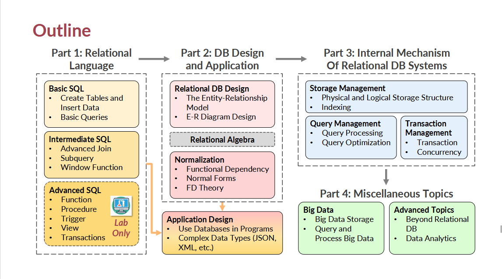

### Relational Database：
All the pieces of data in a row are
related, hence "relational"
A column (or a set of columns) to **differentiate** one row from another
### Primary Key(主键)
Some of the keys may be unique for every row
- Student ID, Email address, 18-digit ID number, etc.
- Usually, it is a good practice to choose the simplest one

### Normalization
- A way of standardize your data
- "First Norm Rule" (1NF)
	Each column should only contain ONE piece of information
	Every non key attribute must provide a fact about the key,the whole key,and nothing but the key.

### Entity and Relationship

## Data Definition and Manipulation
### Data Definition Language (DDL) 数据定义语言
DDL compiler generates **a set of table templates** stored in a data dictionary
### Data Manipulation Language (DML)
Language for accessing and updating the data organized by the appropriate data model (also known as query language)
用于访问和更新由适当数据模型组织的数据的语言（也称为查询语言）

### *SQL （Sructured Query Language)* 结构化查询语言
Takes several tables as input (possibly only one) and always returns a single table

Database applications are usuallypartitioned into two or three parts Application programs generally access databases through one of
1. Language extensions to allowembedded SQL   
2. API( application program interface) (e.g.,ODBC/JDBC) which allow SQL queries to be sent to a database system