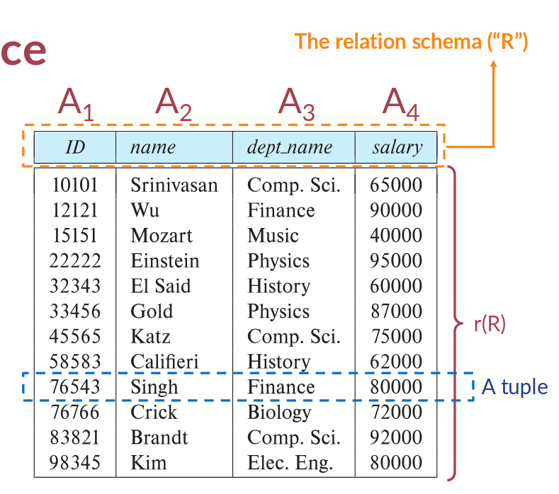

# Relational Model
## Relation(关系) Schema(架构,模式) and Instance(实例)
- $A_1, A_2,..,A_n$ are attributes(属性)
- R = ($A_1,A_2,..,A_n$) is a relation schema(类比变量类型)
- r(R) denotes(表示) a relation instance r defined over schema R (类比变量中储存的值)
- An element t of relation r is called a tuple(元组)


## Attributes
- _Domain (of an attribute)_ : The set of allowed values for the attribute (attribute的允许值集)
- Being __atomic__ :indivisible(不可再分割的)
### NULL in Attributes
==null== : a special marker that represents an "unknown" status ($\ne$ 0, 0.0, false)

## Relations are Unordered
## Database Schema
- Database schema is the logical structure of the database
	- It contains a set of relation schemas and a set of integrity constraints(它包含一组关系模式和一组完整性约束)
- Database instance is a snapshot of the data in the database at a given instant in time (数据库实例是在给定时间的数据库快照)
## Keys
- Let K $\subseteq$ R
	- K is a __superkey__ of R if values for K are __sufficient to identify(足够识别)__ a unique tuple of each possible relation r(R)
	- If K is a superkey, any superset(超集) K' of K where K' $\subseteq$ R is a superkey as well 
- Superkey K is a __candidate key(候选键)__ if K is minimal(即no proper subset of K is a superkey)
> 一个候选键会被选为主键(primary key)
> 我们用下划线标记$\underline{主键}$
- Foreign key(外键) constraint: Values in one relation must appear in another relation
# Introduction to SQL
## Basic Syntax of SQL
```sql
select * from lab where time = '3-34'
```
select ... : followed by the names of the __columns__ you want to return
from ... : followed by the name of the __tables__ that you want to query
where ... followed by filtering conditions (过滤条件)
## Two Main Components for a Query Language
- Data Definition Language (DDL)
	- The SQL data-definition language (DDL) allows the specification of information about relations, including:
		- The schema for each relation
		- The type of values associated with each attribute
		- The Integrity constraints(Integrity Constraints are **the protocols that a table's data columns must follow**)
		- The set of indices(索引) to be maintained for each relation
		- Security and authorization(授权) information for each relation
		- The physical storage structure of each relation on disk
- Data Manipulation Language (DML)
	- Query information from the database
	- Insert tuples into, delete tuples from, and modify(调整) tuples in the database.
> keywords are case-insensitive(大小写不敏感)

## Create Tables
- table names:  case-insensitive
- Naming Convention: Underscores('_') as word separators
- " " -> case-sensitive
```sql
create table r (
	A1 D1, A2 D2, ..., An Dn,
	(integrity-constraint 1),
	...,
	(integrity-constraint k)
)
```
- r is the name of the relation
- $A_i$ is an attribute __name__ in the schema of relation r
- $D_i$ is the __data__ type of values in the domain of attribute $A_i$

## Data Type
- Text data types
	- char(length) --fixed-length strings
	- varchar(max length) --non-fixed-length text
	- varchar2(max length) -- Oracle’s transformation of varchar
	- clob -- very long text (like GB-level text)
		- or text (mysql)
- Numerical types
	- int  -- Integer (a finite subset of the integers that is machine-dependent)
	- float  -- Floating point number, with user-specified precision of at least n digits(用户指定精度)
	- real  -- Floating point and double-precision floating point numbers, with machine-dependent precision
	- numeric(p, d)
		- Fixed point number, with user-specified precision of p digits, with d digits to the right of decimal(十进制) point
		- eg: numeric(3,2) 44.5,11.2,...
- Date types
	- date -- YYYY-MM-DD
	- datetime -- YYYY-MM-DD HH:mm:SS
	- timestamp -- YYYY-MM-DD HH:mm:SS
		- in the UNIX timestamp(时间戳)
- Binary data types
	- raw(max length)
	- varbinary(max length)
	- blob --binary large object
	- bytea --used in psql
## Constraints
- not null
	Use not null to indicate that these columns are mandatory
- unique
	- A unique constraint (on a combination of multiple columns)
- Primary key
	- the value is mandatory(not null)
	- that the values are unique (no duplicates allowed in the column)
- check
	- A column must satisfy a certain boolean expression test
> 约束可以被赋予名字(psql自动赋 if 没有手动),如下图constrain_birth
```sql
create table people (
	id int not null,
	first_name varchar(30),
	surname varchar(30) not null,
	born numeric(4),
	died numeric(4),
	unique (first_name, surname),--The combination of (first_name, surname) cannot be the same for any two rows
)
	constraint birth check(died - born >=0 ),
	check(first_name = upper(first_name)
/* multi-line 
oi */
-- single line
```

> Check constaints are static
> 	once it is written into the table, the criteria cannot be updated automatically

## Referential Integrity

## Foreign Key
- Format
	- foreign key ($A_m,..A_n$) references r
- eg:
		```
```sql
	...
	foreign key (country) references country_list (country_code)
	--country_code should be a key (primary key or unique) in the table country_list
	...
```


> No further checks in the application programs; most things are ensured in the database layer

## Updates to Tables
- Insert
	- insert into instructor values ('10211', 'Smith', 'Biology', 66000);
	- Values must match column names one by one
	- Missing columns and values for “nullable” columns are allowed … and a NULL willl be inserted
	-  But if you miss a mandatory column (such as address), an error will occur.
	- Use two single quotes to represent a single quote in the content (i.e., escape charactor)
- Delete
	- Remove all tuples from the student relation
		- delete from movies
- Drop Table
	- drop table r
- Alter
	- alter table r add A D
		- where A is the name of the attribute (column) to be added to relation r and D is the data type of A.
		- All existing tuples in the relation are assigned null as the value for the new attribute (新属性的值赋为null)
	- alter table r drop column A
		- Dropping of attributes not supported by many databases.
		- (There are some other things that can be “dropped”, including checks, foreign keys, indexes, etc.)