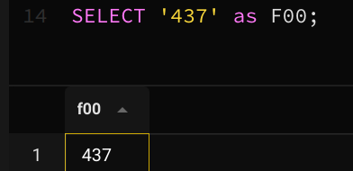
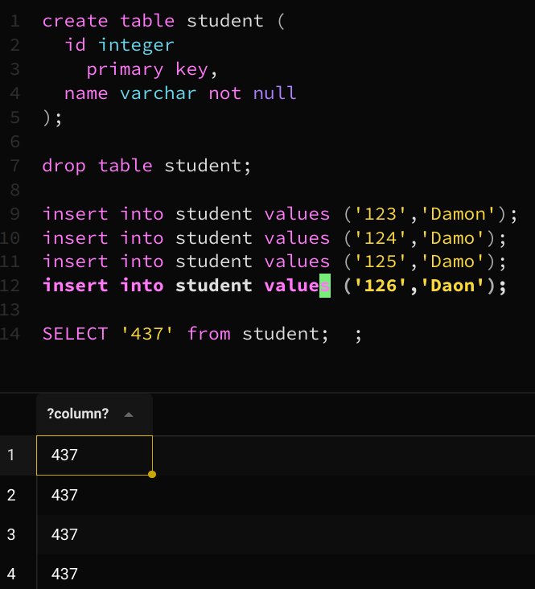
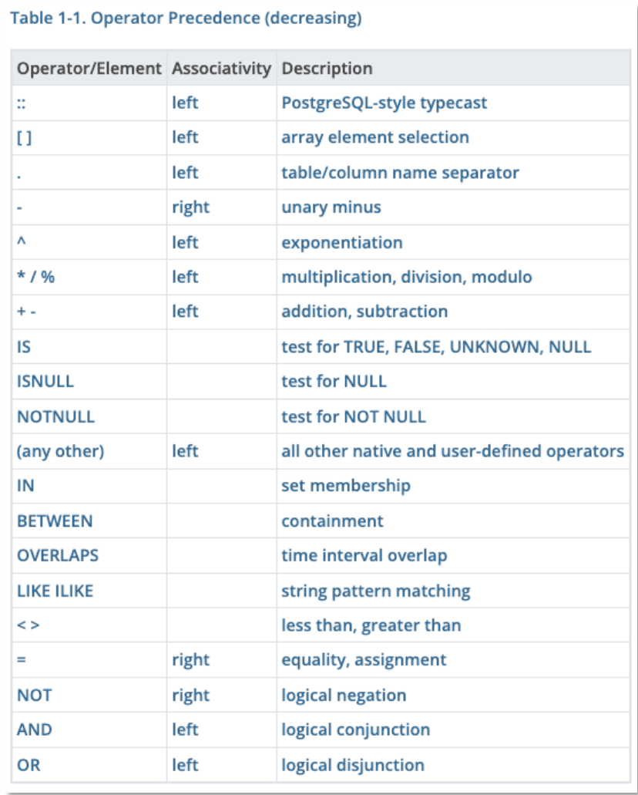

- Select
	- select * from [tablename]
		- To display the full content of a table. you can use select * (all columns)
		- The select clause(子句) lists the attributes desired in the result of a query
	> 	这种查询在交互式工具中常用,但你不应该在应用程序中使用
	
- Restrictions
	- Filtering(过滤)
		- Performed in the "where" clause
		- Conditions are usually expressed by a column name
			- … followed by a comparison __operator__ and the value to which the content of the column is compared
		- Only rows for which the condition is true will be returned
```sql
select * 
from movies 
where country = 'us';
```

- Comparison
	- you can compare to 
		- a number
		- a string constant
		- another column (from the same table or another, we'll see queries involving several tables later)
		- the result of a function (we'll see them soon)

> string constant must be quoted between single-quotes(' ')
> 	If they aren't quoted, they wiil be interpreted as column names

- Filtering
	- Note that a filtering condition returns a subset
		- If you return all the columns from a table without duplicates(重复), it won't contain duplicates either and will be a valid "relation"

- Select without From or Where
	- An attribute(属性) can be a literal with no from clause
		`select '437'`
		- Results is a table with one column and a single row with value “437”
		- __rename__: Can give the column a name using:
		`select '437' as FOO`
		
	- An attribute can be a literal with from clause
		`select 'A' from movies`
		- Result is a table with one column and N rows (number of tuples in the movies table), each row with value "A"
		

- Arithmetic Expression
	- select子句可以包含算术表达式(+ ,- ,* ,/ ), 作用在constants or arributes of tuples
- Logical Connectives
	- and, or, not
		- 就像编程语言一样
		- 有不同优先级(and > or), 可以用括号(parentheses)改变运算顺序
			
- The operands of the logical connectives can be expressions __involving__ the comparison operators <, <=, >, >=, =, and <>.
	- != and <> 都可以表示not equal to
- 注意data type
	- 2 < 10 is true but '2' < '10' is false
- in()
	- It can be used as the equivalent for a series of equalities with or
		`where (a = 'us' or a = 'ch'`
		`where a in ('us`, 'ch')`
- Negation
	- All comparisons can be negated with not
```sql
where not (   (country in ('us', 'gb')) and (year_released between 1940 and 1949)   )
where (country in ('us', 'gb')) and (year_released between 1940 and 1949)
```

- between Comparison Operator
	- between ... and ...
		- shorthand for: >= and <= (左闭右闭)
- like
	- For strings, you also have like which is a kind of regex (regular expression 正则表达式) for dummies.
	- like compares a string to a pattern that can contain two wildcard characters:
		- % meaning "any number of characters, including none”
		- _ meaning "one and only one character"

