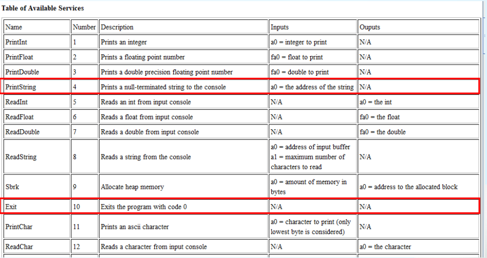

##### lab1
- Assembly Program Structure
	- Data Declarations
		- .data(placed in section of program identified with assembler directive(汇编说明/汇编器指示符)
		- declare variable names used in program; storage allocated in main memory (RAM)
	- Program Code
		- .text
	- Comments
		- `#` on a line

##### lab2
- RARS
	- System Call
		

		li a7, [Number]
		ecall
		调用上述function
		例如
		li a7, 1
		ecall
		将会打印1

- Data transfer: load & store
	- In RISC-V
		- memory could only be accessed by data transfer instruction
		- data must be in registers to perform arithmetic
	- load: transfer data to register
		- lw: load word
		- lb: load byte
		- lui: load upper immediate
			- lui x5, 0x12345
			- x5 = 0x12345 __000__ (20-bit 的immediate左移12bit成为32bit)
			- Load 20-bit constant shifted left 12bits
		- la: load address(pesudo instruction 伪指令)
			- implemented by two basic instructions
				- auipc(add upper immediate to PC(program counter))
				- addi
			- la x5, label1
			- x5 = label1's address
	- store: transfer data from register to memory
		- sw
		- sb
- macro_print_str.asm
```
	.macro print_string(%str)
		.data
			pstr: .asciz %str
		.text
			la a0,pstr
			li a7,4
			ecall
.end_macro

.macro end
	li a7,10
	ecall
.end_macro

```

##### lab3

# 杂记
- 机器码占4个字节