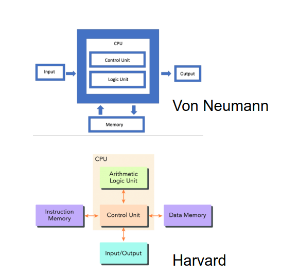

__computer__:
- CPU(Processor):
		- datapath
		- control
- memory
- Devices
	- input
	- output

__great idea__:
1. Abstraction(抽象) (Layers of Representation/Interpretation)
	- anything can be a _number_
	- A set of assembly language insructions(ISA) provides a link between software and hardware
2. Moore’s Law
	the number of transistors on microchips doubles every two years([集成电路](https://zh.wikipedia.org/wiki/%E9%9B%86%E6%88%90%E7%94%B5%E8%B7%AF "集成电路")上可容纳的[晶体管](https://zh.wikipedia.org/wiki/%E6%99%B6%E4%BD%93%E7%AE%A1 "晶体管")数目，每隔约两年便会增加一倍)
3. Principle of Locality/Memory Hierarchy

4. Parallelism(并行性)
5. Performance Measurement & Improvement
6. Dependability via Redundancy
