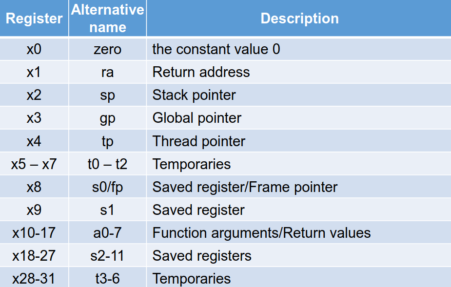
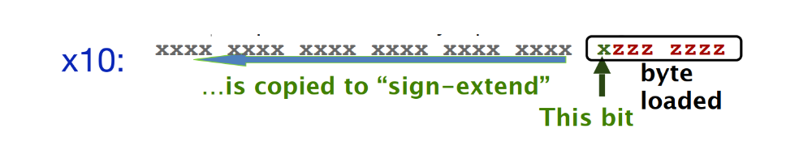
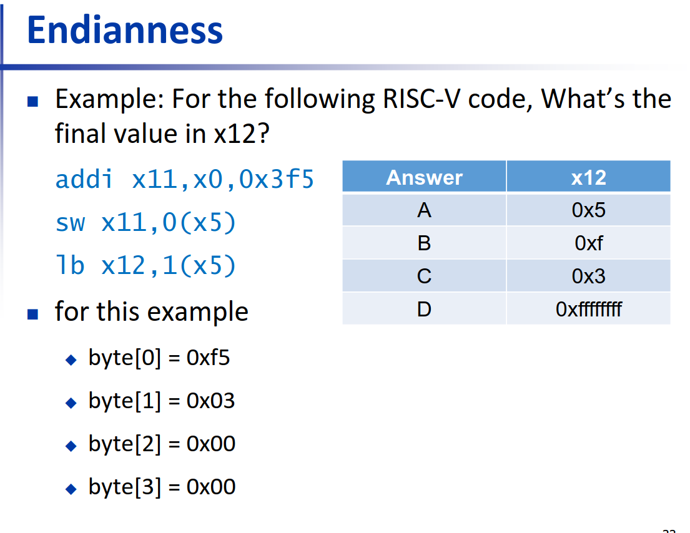
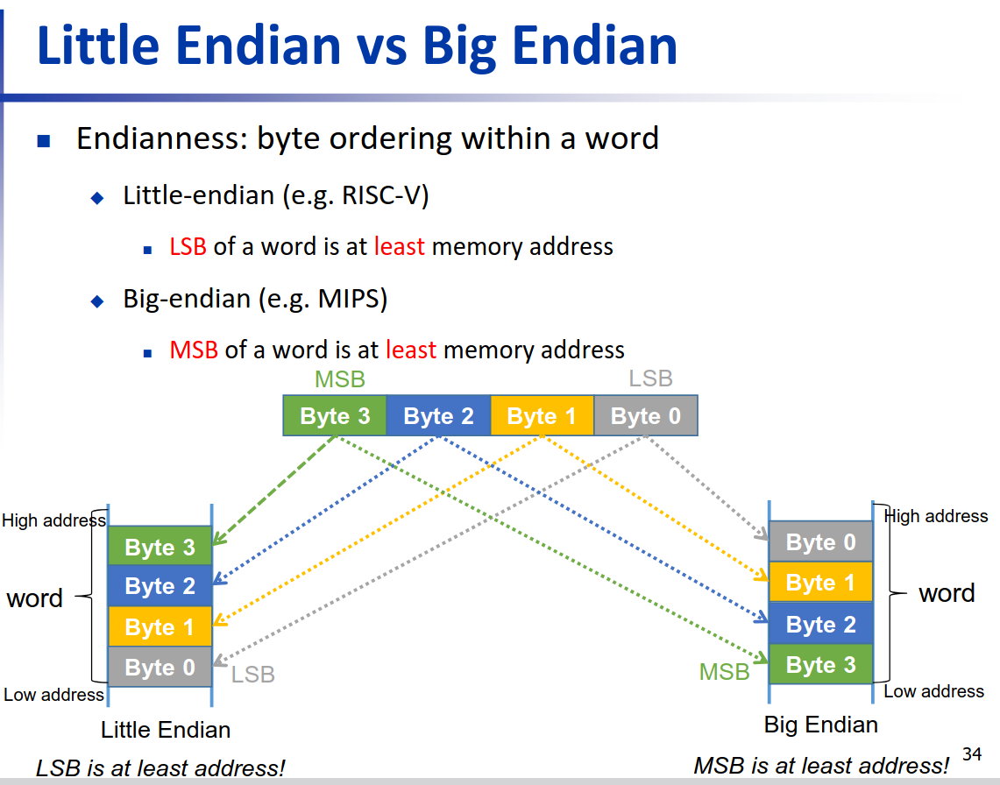
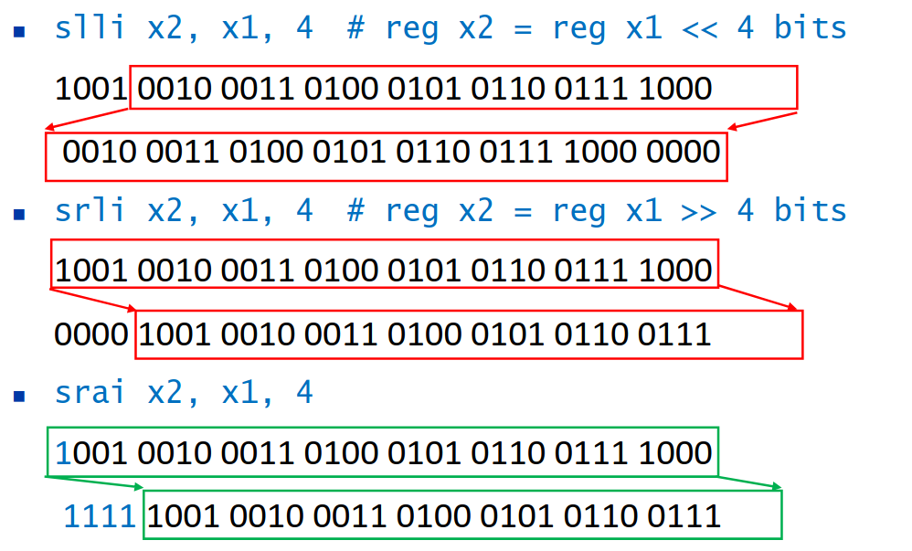

> RISC-V introduction
#### concept
• Application software
	• Written in high-level language
• System software
	• Compiler: translates HLL(hight-level language) code to machine code
• Operating System:
	• Handling input/output
	• Managing memory and storage
	• Scheduling tasks & sharing resources(调度任务和共享资源)
• Hardware
	• Processor(处理器), memory, I/O controllers

#### Levels of Program Code
- High-level language
- Assembly language(汇编语言)
- Machine language
#### Abstraction(抽象)
__Instruction(指令) Set Architecture (ISA,指令集架构)__
• _A set of assembly language instructions_ (ISA) provides a link between software and hardware.
• Common types of ISA: RISC, CISC
	• IBM370/X86 (CISC)
	• RISC-V (RISC)
	• MIPS (RISC)
	• ARM (RISC)
##### ISA
• Instructions: CPU’s primitive(原始) operations
	• Instructions performed __one after another__ in sequence
	• Each instruction does a **small** amount of work (a tiny part of a larger program).
	• Each instruction has an operation applied to operands(操作数), and might be used to change the sequence of instructions.
• CPUs belong to “families,” each implementing its own set of instructions
• CPU’s particular(特定的) set of instructions implements an Instruction Set Architecture (ISA)
	• Examples: ARM, Intel x86, MIPS, RISC-V, PowerPC...

##### CISC vs RISC
- CISC:
	- Complex Instruction Set Computer
	- Variable instruction length
	- Much more powerful instructions
	- Hardware intensive(密集) instructions (more transistors(晶体管)
	- e.g. x86

- RISC:
	-  Reduced Instruction Set Computer
	-  __Fixed__ instruction size
	-  Simple instructions (load/store)
	-  Emphasizes(强调) more on software (compiler)
	-  e.g. MIPS, ARM, PowerPC, RISC-V

>CISC: wintel(windows + intel)
>RISA: 
>	AA(ARM + Apple)
>	RISC-V

#### Basic Assembly instruction
**Translate the following C code into assembly code**:
- C:
	a = b + c + d + e;
- Assembly:
	add a, b, c             add a, b, c
	add a, a, d     __or__    add f, d, e
	add a, a, e             add a, a, f

All arithmetic operations have this form: add a, b, c(a = b + c)
- C code: f = (g + h) - (i + j)
- Assembly:
	add t0, g, h # 这是一个注释
	add t1, i, j
	sub f, t0, t1

#### Assembly Variables: Registers
汇编语言没有variables, Assembly language operands are objects called __registers__
>RISC-V Registers
>`本课程使用32bit`
>Each RISC-V register is 32 bits wide called a “word”
>Registers have __no type__
>Operation determines how register contents are interpreted


Instructions have an opcode and opeands
例: add x1, x2, x3
- add: Operation code(opcode)
- x1: Destination register
- x2: First operand register
- x3: Second operand register
##### Register x0
> x0 is special, always holds the value zero and can't be changed(不需要初始化)
- Copy a value from one register to another(add x3, x4, x0 same as f = g )
- whenever a value is produced and we want to throw it away, write to x0
- By convention RISC-V has a specific no-op instruction
	add x0,x0,x0
- see later with “jump-and-link” instruction

##### Immediates
> Immediates are used to provide numerical constants, 即时数用于提供数值常数, 语法和add类似但是最后一个参数是 number 而不是 register

addi x3, x4, -10
same as f = g - 10
no subtract immediate instruction

##### Numeric Representations(数字表示)
- Decimal $35_{10}$ or $35_{ten}$ 
- Binary $00101_2$ or $00101_{two}$
- 十六进制Hexadecimal $0x23$ or $23_{hex}$
	0-15(decimal) -> 0-9,a-f(hex)

- unsigned:
$$x=x_{n-1}2^{n-1} + x_{n-2}2^{n-2 } + ...+x_12^1+x_02^0$$
- signed:
$$x=-x_{n-1}2^{n-1}+x_{n-2}2^{n-2}+...+x_12^1+x_02^0$$
	- Complement(取反)
$$ x + \overline{x} = -1$$
$$ \overline{x} +1 = -x$$
##### Immediates & Sign Extension
> Immediates are necessarily small
> An I-type instruction can only have 12 bits of immediate
 
In RISC-V immediates are "__sign extended__"
	the upper bits are the same as the top bit
e:
- 例子(8bits to 16bits):
	- +2:***0***000 0010 => ***0000 0000 0***000 0010
	- -2 ***1***111 1110 => ***1111 1111 1***111 1110
对于 12bit的immediate也是一样,addi时需要补全immediate,即Bits[31:12] get the the value as Bit 11

##### Data transfer Operations
- Registers vs. Memory
	- Arithmetic operations can only be performed on registers
	- Thus, the only memory actions are loads & stores
- Given that 
	- Registers: 32 words (128 Bytes)
	- Memory (DRAM,动态随机存取存储器): Billions of bytes (2 GB to 16 GB on laptop)

##### Memory Addresses are in Bytes
- Data typically smaller than 32 bits, but rarely smaller than 8 bits(eg char type)
- Remember, size of __word__ is 4 bytes
- Memory is addressable to individual bytes(**内存是以字节（byte）为单位进行寻址的**，也就是说，每个字节都有唯一的地址，你可以单独访问它。)
- Word addresses are 4 bytes apart(单词地址相距4个字节)
- RISC-V does not require words to __be aligned in__ (对齐)memory(练习中要求integers word-aligned)

##### Transfer from Memory to Register
- C:
	int A[100];
	g = h + A[8];
	- Assume(假设): x13 holds _base register_ (pointer to A[0])
	- 32 is offset(偏移) in bytes
	- Offset must be a constant known at assembly time

Using Load Word (lw) in RISC-V:
```RISC-V
lw x10,32(x13) # register x10 gets A[8] whose offset is 32 from x13
add x11,x12,x10 # g = h + A[8]
```
偏移量(32) = 数组序列数(8) x word字节数(4)
lb(load byte) 1byte; 1h 2 byte; 1d 8 byte(h 为half word, d为double)
##### Transfer from Register to Memory
Using Store Word(sw) in RISC-V
lw x10,32(x13) # reg x10 gets A[8] 
add x11,x12,x10 # g=h+A[8]
==sw x11,40(x13)== # A[10]=h+A[8]

x13+32 and x13+40 must be multiples of 4 to maintain alignment 

- byte data transfers:
	- load byte: lb
	- store byte: sb
	- eg: lb x10,3(x11)

(一个byte 有8位, 取最高位进行扩展)

同时我们有 __unsigned byte__ load (lbu) which zero extend to fill register, but no sbu because store a byte just need the last 8 bit(不需要考虑有无符号位)

##### Endianness

选C:
addi x11,x0,0x3f5 -- 给x11赋值为0x3f5 (0000 ... 0000(20个0) 0011 1111 0101), 有符号扩展,当符号位为1时要填充1
sw x11,0(x5) -- 将x11中一个word(4 byte)储存到x5所存的地址处
lb x12,1(x5) --在距x5地址1 byte 处取1 byte 并有符号扩展, 即对1111 进行有符号扩展得到0xffffffff

(本图解释了为什么RISC-V中 1(x5) 在0(x5)左边)

##### Logical Operations

| Operation          | C   | RISC-V    |
| ------------------ | --- | --------- |
| Shift left logical | <<  | sll       |
| Shift right        | >>  | srl/sra   |
| Bitwise AND        | &   | and, andi |
| Bitwise OR         | \|  | or, ori   |
| Bitwise XOR        | ~   | xor,xori  |
- Shift left logical
	- Shift left and fill with 0 bits
	- slli by i bits multiplies by $2^i$
- Shift right logical
	- Shift right and fill with 0 bits
	- srli by i bits divides by $2^i$ (unsigned only)
- Shift right arithmetic
	- 补全数取决于符号位

- NOT(按位取反) can be implemented with XOR
	- xori x15,x14,-1 (-1表示为1111...1111)
